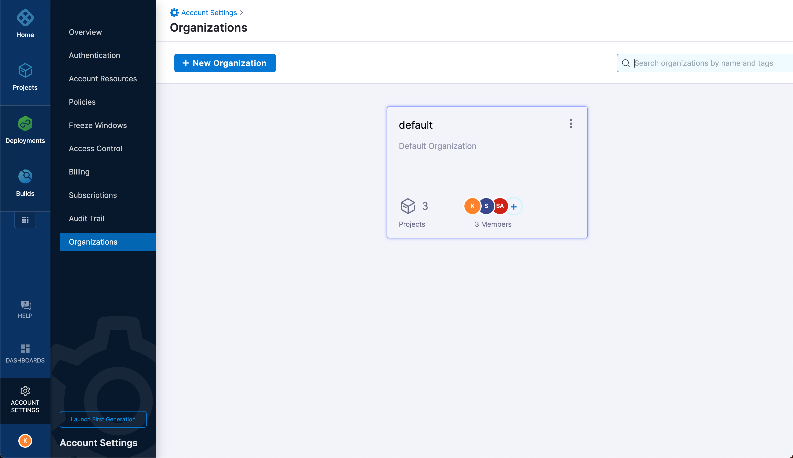
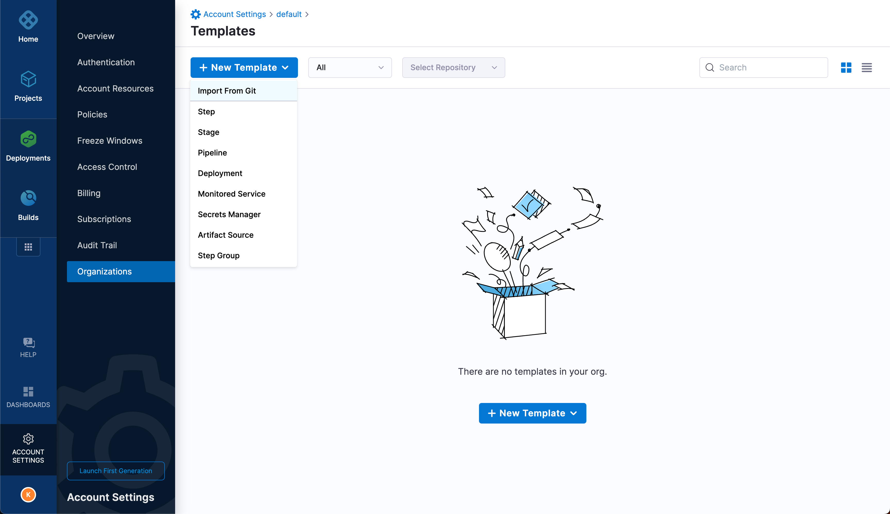
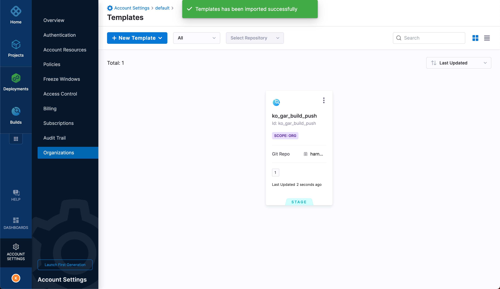
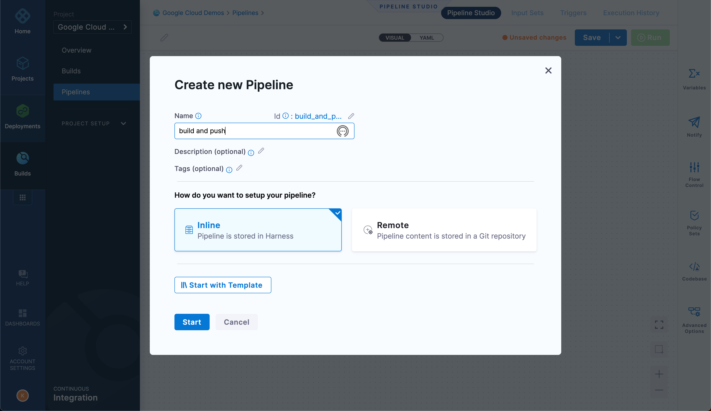
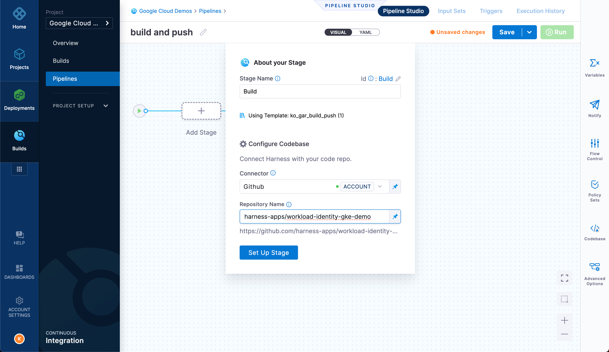

# Using Workload Identity

A demo to show how to use [Workload Identity](https://cloud.google.com/kubernetes-engine/docs/concepts/workload-identity) with Harness Pipelines.

In this demo we will build Harness CI pipeline that will use GKE as its build infrastructure. As part of the build infrastructure on GKE we will deploy a Harness Delegate to run our CI pipelines on our GKE.

## Pre-requisites

- [Google Cloud Account](https://cloud.google.com)
  - With a Service Account with roles
    - `Kubernetes Engine Admin` - to create GKE cluster
    - `Service Account` roles used to create/update/delete Service Account
      - iam.serviceAccounts.actAs
      - iam.serviceAccounts.get
      - iam.serviceAccounts.create
      - iam.serviceAccounts.delete
      - iam.serviceAccounts.update
      - iam.serviceAccounts.get
      - iam.serviceAccounts.getIamPolicy
      - iam.serviceAccounts.setIamPolicy
     Or simply you can add `Service Account Admin` and `Service Account User` roles
    - `Compute Network Admin`   - to create the VPC networks
  - Enable Cloud Run API on the Google Cloud Project, if you plan to deploy to Google Cloud Run
- [Google Cloud SDK](https://cloud.google.com/sdk)
- [terraform](https://terraform.build)
- [kubectl](https://kubernetes.io/docs/tasks/tools/)
- [helm](https://helm.sh)
- [Taskfile](https://taskfile.dev)

Ensure that you have the following Harness Account Details,

- Harness Account ID
- Harness Delegate Token

### Optional tools

- [kustomize](https://kustomize.io)
- [direnv](https://direnv.net)

## Download Sources

Clone the sources,

```shell
git clone https://github.com/harness-apps/workload-identity-gke-demo.git && cd "$(basename "$_" .git)"
export DEMO_HOME="$PWD"
```

(OR) If you are using zsh, then you can use the following commands

```shell
take  https://github.com/harness-apps/workload-identity-gke-demo.git
export DEMO_HOME="$PWD"
```

## Environment Setup

### Variables

When working with Google Cloud the following environment variables helps in setting the right Google Cloud context like Service Account Key file, project etc., You can use [direnv](https://direnv.net) or set the following variables on your shell,

```shell
export GOOGLE_APPLICATION_CREDENTIALS="the google cloud service account key json file to use"
export CLOUDSDK_ACTIVE_CONFIG_NAME="the google cloud cli profile to use"
export GOOGLE_CLOUD_PROJECT="the google cloud project to use"
```

You can find more information about gcloud cli configurations at <https://cloud.google.com/sdk/docs/configurations>.

As you may need to override few terraform variables that you don't want to check in to VCS, add them to a file called `.local.tfvars` and set the following environment variable to be picked up by terraform runs,

```shell
export TFVARS_FILE=.local.tfvars
```

>\_\_NOTE\_\_: All `*.local.tfvars` file are git ignored by this template.

Check the [Inputs](#inputs) section for all possible variables that are configurable.

## Inputs

| Name | Description | Type | Default | Required |
|------|-------------|------|---------|:--------:|
| <a name="input_app_ksa"></a> [app\_ksa](#input\_app\_ksa) | the kubernetes service account that will be used to run the lingua-greeter deployment | `string` | `"lingua-greeter"` | no |
| <a name="input_app_namespace"></a> [app\_namespace](#input\_app\_namespace) | the kubernetes namespace where the lingua-greeter demo application will be deployed | `string` | `"demo-apps"` | no |
| <a name="input_app_use_workload_identity"></a> [app\_use\_workload\_identity](#input\_app\_use\_workload\_identity) | Flag to enable/disable application(pod) from using Workload Identity | `bool` | `false` | no |
| <a name="input_builder_ksa"></a> [builder\_ksa](#input\_builder\_ksa) | the kubernetes service account that will be used to run the Harness delegate builder pods, which is enabled with Workload Identity | `string` | `"harness-builder"` | no |
| <a name="input_builder_namespace"></a> [builder\_namespace](#input\_builder\_namespace) | the namespace where all Harness builder pods will be run | `string` | `"default"` | no |
| <a name="input_cluster_name"></a> [cluster\_name](#input\_cluster\_name) | the gke cluster name | `string` | `"my-demos"` | no |
| <a name="input_gke_num_nodes"></a> [gke\_num\_nodes](#input\_gke\_num\_nodes) | number of gke nodes | `number` | `2` | no |
| <a name="input_harness_account_id"></a> [harness\_account\_id](#input\_harness\_account\_id) | Harness Account Id to use while installing the delegate | `string` | n/a | yes |
| <a name="input_harness_delegate_image"></a> [harness\_delegate\_image](#input\_harness\_delegate\_image) | The Harness delegate image to use | `string` | `"harness/delegate:23.02.78306"` | no |
| <a name="input_harness_delegate_name"></a> [harness\_delegate\_name](#input\_harness\_delegate\_name) | The Harness Delegate name | `string` | `"harness-delegate"` | no |
| <a name="input_harness_delegate_namespace"></a> [harness\_delegate\_namespace](#input\_harness\_delegate\_namespace) | The Harness Delegate Kubernetes namespace | `string` | `"harness-delegate-ng"` | no |
| <a name="input_harness_delegate_replicas"></a> [harness\_delegate\_replicas](#input\_harness\_delegate\_replicas) | The Harness delegate kubernetes replica count | `number` | `1` | no |
| <a name="input_harness_delegate_token"></a> [harness\_delegate\_token](#input\_harness\_delegate\_token) | Harness Delegate token | `string` | n/a | yes |
| <a name="input_harness_manager_endpoint"></a> [harness\_manager\_endpoint](#input\_harness\_manager\_endpoint) | The Harness SaaS manager endpoint to use | `string` | n/a | yes |
| <a name="input_install_harness_delegate"></a> [install\_harness\_delegate](#input\_install\_harness\_delegate) | Flag to install Harness Delegate | `bool` | `true` | no |
| <a name="input_kubernetes_version"></a> [kubernetes\_version](#input\_kubernetes\_version) | the kubernetes versions of the GKE clusters | `string` | `"1.24."` | no |
| <a name="input_machine_type"></a> [machine\_type](#input\_machine\_type) | the google cloud machine types for each cluster node | `string` | `"e2-standard-4"` | no |
| <a name="input_project_id"></a> [project\_id](#input\_project\_id) | project id | `any` | n/a | yes |
| <a name="input_region"></a> [region](#input\_region) | the region or zone where the cluster will be created | `string` | `"asia-south1"` | no |
| <a name="input_release_channel"></a> [release\_channel](#input\_release\_channel) | the GKE release channel to use | `string` | `"stable"` | no |

### Example
  
An example `my.local.tfvars` that will use a Google Cloud project **my-awesome-project**, create a two node GKE cluster named **wi-demo** in region **asia-south1** with Kubernetes version **1.24.** from **stable** release channel. The machine type of each cluster node will be **e2-standard-4**.

You may need to update following values with actuals from your Harness Account,

- `harness_account_id`
- `harness_delegate_token`
- `harness_delegate_namespace`
- `harness_manager_endpoint`

> **NOTE**:
> 
> - `harness_manager_endpoint` value is can be found here <https://developer.harness.io/tutorials/platform/install-delegate/>, to right endpoint check for your **Harness Cluster Hosting Account** from the Harness Account Overview page.
> In the example above my **Harness Cluster Hosting Account** is **prod-2** and its endpoint is <https://app.harness.io/gratis>
>

```hcl
project_id                 = "pratyakshika"
region                     = "asia-south1"
cluster_name               = "wi-demos"
kubernetes_version         = "1.24."
install_harness_delegate   = true
harness_account_id         = "REPLACE WITH YOUR HARNESS ACCOUNT ID"
harness_delegate_token     = "REPLACE WITH YOUR HARNESS DELEGATE TOKEN"
harness_delegate_name      = "wi-demos-delegate"
harness_delegate_namespace = "harness-delegate-ng"
harness_manager_endpoint   = "https://app.harness.io/gratis"
```

> **NOTE**: For rest of the section we assume that your tfvars file is called `my.local.tfvars`

## Create Environment

We will use terraform to create a GKE cluster with `WorkloadIdentity` enabled for its nodes,

```shell
task init
```

### Create GKE cluster

The terraform apply will creates a Kubernetes(GKE) Cluster,

```shell
task create_cluster
```
  
### Deploy Harness Delegate

Ensure you have the following values set in the `.local.tfvars` before running the `task apply` command.

- Use **Account Id** from Account Overview as the value for **harness_account_id**,


- Use the `Harness Cluster Hosting Account` from the account details to find the matching endpoint URL. e.g for `prod-2` it is <https://app.harness.io/gratis> and set that as value for `harness_manager_endpoint`.

- Copy the default token from **Projects** --> **Project Setup** --> **Delegates**(**Tokens**) and set it as value for `harness_delegate_token`.


- `harness_delegate_name`: defaults to **harness-delegate**
- `harness_delegate_namespace`: defaults to **harness-delegate-ng**

```shell
task deploy_harness_delegate
```
  
## Build Application

Let us build the application using Harness CI pipeline.

### Import Template

The sources already has [build stage](.harness/ko_gar_build_push_1.yaml) template that can be used to create the CI pipeline.

Navigate to your Harness Account, **Account Overview** --> **Organizations** and select **default** organization.



From the organization overview page select **Templates**,


Click **New Template** and choose **Import From Git** option,



Fill the wizard with values as shown,


>**NOTE**: If you want to use your fork of `harness-apps/workload-identity-gke-demo` then update _Repository_ with your fork.
>



## Create Pipeline

Navigate to **Builds** --> **Pipelines**, click **Create Pipeline**.



Click **Add Stage** and click **Use template**, choose **ko_gar_build_push** template that we imported earlier and click **Use template** to complete import.

Enter details about the stage,



Click **Setup Stage** to crate the stage and fill other details i.e **Template Inputs**,


We use `default` namespace to run builder pods. The build pod runs with a Kubernetes Service Account(KSA) `harness-builder`.

> **NOTE**:
> The `harness-builder` KSA is mapped to Google IAM Service Account(GSA) `harness-delegate` to inherit the GCP roles using Workload Identity in this case to push the images to Google Artifact Registry(GAR).
>

Click **Run** to run the pipeline to see the image build and pushed to GAR.

### Deploy Application

**TODO** : Cloud Run deploy CD Pipeline

## Outputs

| Name | Description |
|------|-------------|
| <a name="output_harness_delegate_service_account"></a> [harness\_delegate\_service\_account](#output\_harness\_delegate\_service\_account) | The Google Service Account 'harness-delegate' that will be used with 'harness-builder' Kubernetes SA |
| <a name="output_kubeconfig_path"></a> [kubeconfig\_path](#output\_kubeconfig\_path) | Kubeconfig file |
| <a name="output_kubernetes_cluster_host"></a> [kubernetes\_cluster\_host](#output\_kubernetes\_cluster\_host) | GKE Cluster Host |
| <a name="output_kubernetes_cluster_name"></a> [kubernetes\_cluster\_name](#output\_kubernetes\_cluster\_name) | GKE Cluster Name |
| <a name="output_project_id"></a> [project\_id](#output\_project\_id) | GCloud Project ID |
| <a name="output_region"></a> [region](#output\_region) | GCloud Region |
| <a name="output_translator_service_account"></a> [translator\_service\_account](#output\_translator\_service\_account) | The Google Service Account 'translator' |
| <a name="output_zone"></a> [zone](#output\_zone) | GCloud Zone |

## References

- [Harness CI](https://app.harness.io/auth/#/signup/?module=ci?utm_source=internal&utm_medium=social&utm_campaign=community&utm_content=kamesh-github&utm_term=diy-demos)
- [Developer Hub](https://developer.harness.io)
- [Harness Delegate](https://developer.harness.io/tutorials/platform/install-delegate/)
- [Workload Identity](https://cloud.google.com/kubernetes-engine/docs/how-to/workload-identity)

## License

[Apache License](./../LICENSE)
